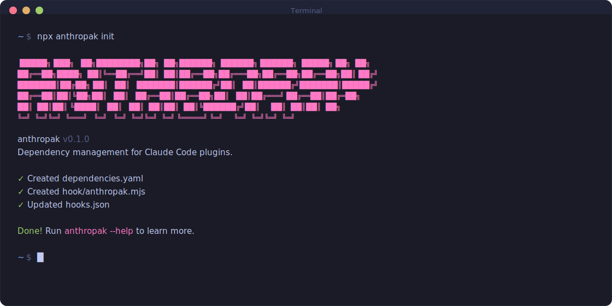

<p align="center">
  
</p>

A CLI tool and hook system that lets Claude Code plugins declare and check for dependencies on other plugins. When a plugin depends on MCP servers or other Claude Code plugins, anthropak ensures users are notified about missing dependencies.

## Table of Contents

- [Install](#install)
- [Usage](#usage)
- [Packages](#packages)
- [How It Works](#how-it-works)
- [Contributing](#contributing)
- [License](#license)

## Install

### Homebrew

```bash
brew install zrosenbauer/tap/anthropak
```

### npm

```bash
npm install -g anthropak
```

### From Source

```bash
git clone https://github.com/zrosenbauer/anthropak.git
cd anthropak
pnpm install
pnpm build
```

## Usage

### Initialize a Plugin

In your Claude Code plugin directory:

```bash
anthropak init
```

This creates:

- `dependencies.yaml` - Declare your plugin's dependencies
- `hook/anthropak.mjs` - Hook script that checks for missing dependencies
- Updates `hooks.json` - Registers the hook with Claude Code

### Declare Dependencies

Edit `dependencies.yaml`:

```yaml
dependencies:
  required:
    - plugin: some-mcp-server
      marketplace: some-mcp-server
      description: Required for data fetching
  optional:
    - plugin: another-plugin
      github: owner/repo
      description: Enables additional features
```

### Update Hook

To update the hook script to the latest version:

```bash
anthropak update
```

## Packages

| Package                            | Description                                                |
| ---------------------------------- | ---------------------------------------------------------- |
| [anthropak](./packages/cli)        | CLI tool for initializing and managing plugin dependencies |
| [@anthropak/hook](./packages/hook) | Hook script that runs in Claude Code to check dependencies |

## How It Works

1. Plugin authors run `anthropak init` to set up dependency checking
2. Authors declare dependencies in `dependencies.yaml`
3. When Claude Code loads the plugin, the hook script runs
4. The hook checks Claude's installed plugins registry
5. Missing dependencies are reported to the user via system message

## Contributing

PRs welcome. Please open an issue first to discuss changes.

## License

MIT
